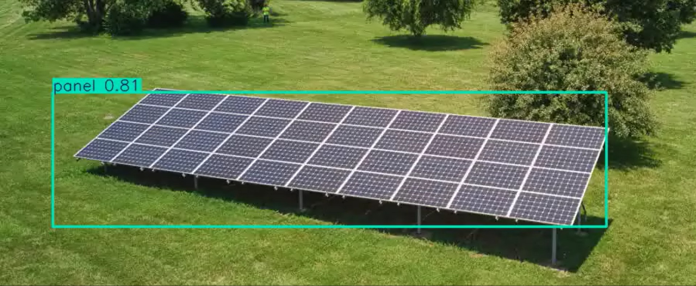

# Quadcopter Solar Panel Detection

## 📝 Proje Hakkında

Bu proje, **TEKNOFEST İHA (İnsansız Hava Aracı)** yarışmaları kapsamında geliştirilmiştir. Quadcopter (drone) üzerinden alınan görüntüler kullanılarak güneş panellerinin otonom tespiti hedeflenmiştir.

Proje, havadan çekilen görüntülerdeki güneş panellerini tespit etmek, konumlandırmak veya durum analizi yapmak amacıyla görüntü işleme algoritmaları (Python & OpenCV) kullanır.